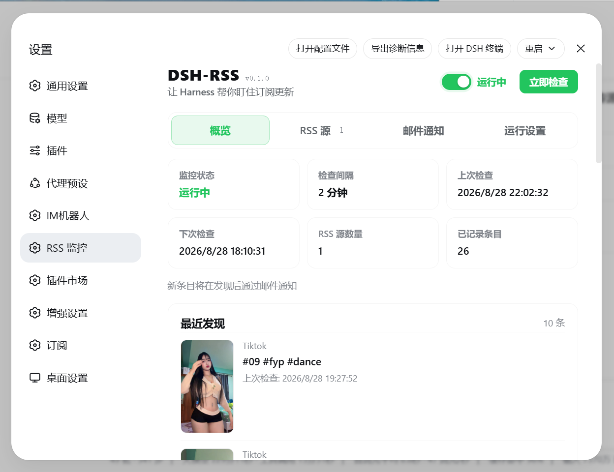
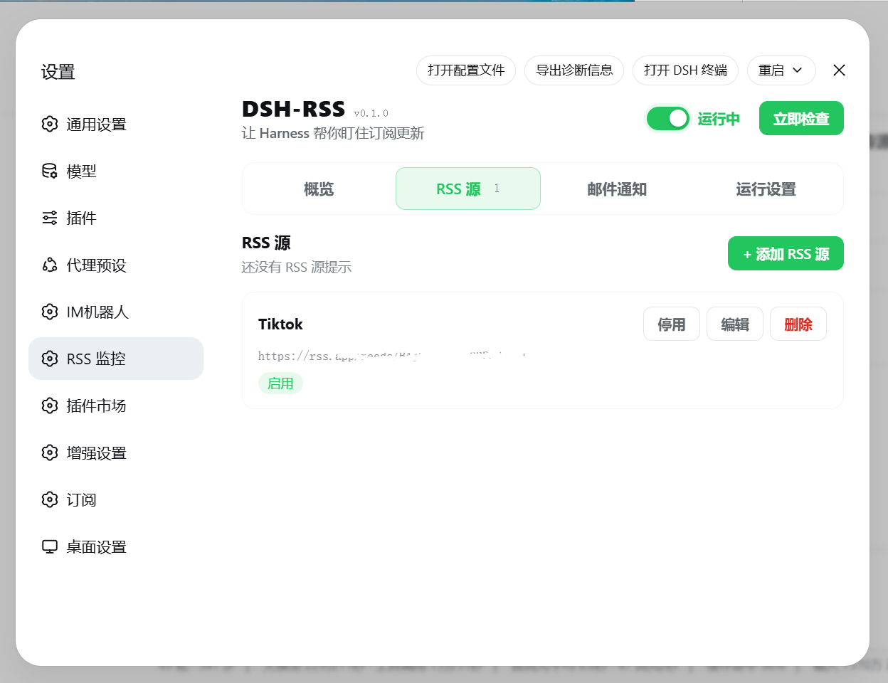
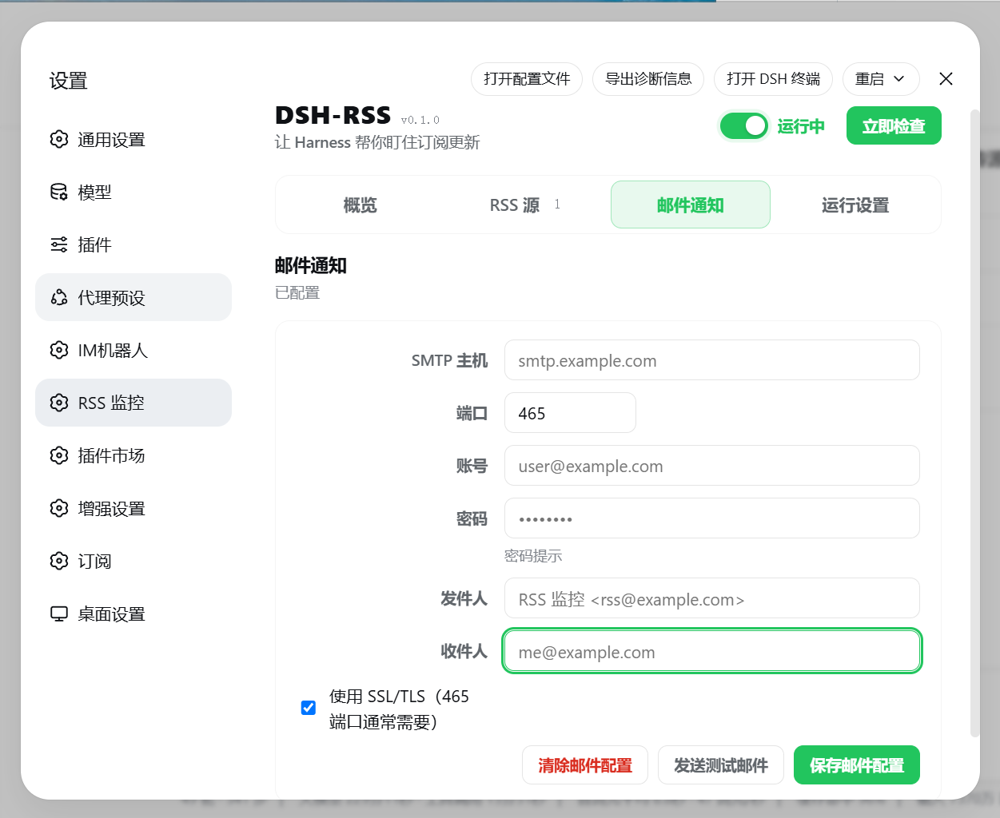
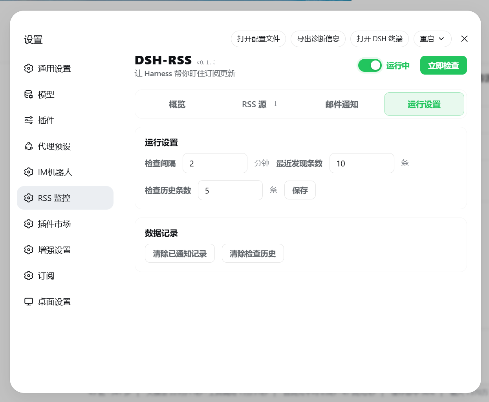

<div align="center">

# 📡 dsh-rss-monitor

**DeepSeek Harness 原生 RSS 订阅监控插件 —— 定时检查、关键词过滤、新条目邮件通知，原生设置页体验**

多源订阅 · 关键词过滤 · 智能去重 · HTML 邮件通知 · 凭据安全存储


</div>

---

## ✨ 功能特性

| | 功能 | 说明 |
|---|---|---|
| 📡 | **多源订阅** | RSS 2.0 / Atom 均支持；添加前可「测试连接」预览标题与最新条目 |
| 🔍 | **关键词过滤** | 每源独立的**包含/排除**关键词（匹配标题与摘要），多个关键词逗号分隔 |
| ⏰ | **定时检查** | 间隔 1–1440 分钟可调（默认 5 分钟）；顶部开关启停监控；随时手动「立即检查」 |
| 🧹 | **智能去重** | `md5(feedUrl\|guid\|\|link\|\|title)` 前 16 位作为稳定 id，环形窗口上限 1000 条 |
| 📧 | **邮件通知** | SMTP（SSL 465 等），精美 HTML 模板带缩略图卡片，2s/4s 指数退避重试，可发测试邮件 |
| 🖥️ | **原生设置页** | 通过 slots 注入 Harness 设置界面：概览 / RSS 源 / 邮件通知 / 运行设置 四个页签，中英双语 |
| 📊 | **概览面板** | 运行状态、上次/下次检查、最近发现（缩略图原始比例、标题可点击）、检查历史（手动/自动、新条目数、错误） |
| 🔢 | **显示条数可调** | 「最近发现」与「检查历史」各 1–100 行自行设置，已记录条目始终显示真实总数 |
| 🔄 | **自动刷新** | 设置页每 15 秒拉取状态，数据无变化不重渲染，窗口后台自动暂停轮询 |
| 🔒 | **凭据安全** | SMTP 密码只存 Harness 凭据库（`DSH_RSS_SMTP_PASS_*`），配置文件中仅存引用 `passRef`，界面与磁盘永不见明文 |

> 🧪 **实验性 / 隐藏功能**:`v0.2.0+` 代码中已实现一些尚未在此 README 文档化的功能（例如「运行设置」中的「时间区间」折叠区：可按星期 + 起止时间限制监控只在窗口内运行，支持跨夜 22:00–06:00 与 UTC / 系统时区）。这些功能在安装后的设置页可见，但出于稳定性考虑暂未列入正式说明。遇到问题请到 [issues](https://github.com/hgl011091/dsh-rss-monitor/issues) 反馈。

## 📸 界面预览


<table>
  <tr>
    <td></td>
    <td></td>
  </tr>
  <tr>
    <td></td>
    <td></td>
  </tr>
</table>


## 📦 安装

> **先选对你的客户端。** DSH 有两种发行版：
>
> | 客户端 | 长什么样 | 插件如何被发现 |
> |---|---|---|
> | **DSH Web**（`dsh web`，Node 包） | 浏览器打开 `localhost:9191` | 启动时官方 boot 组合自动发现已安装的 `dsh.bundle` 插件 |
> | **DSH Desktop**（`DSH Desktop.exe`，Electron 桌面端） | 系统托盘的窗口 | 重启时官方 boot 组合 + 内置 `dshmarket` 的 shim-mount 完成发现 |
>
> 两种客户端都提供官方 `dsh plugin` 命令（Desktop 上是 `desktop-cli.js`，内部把参数转发给 profile 目录里的 pnpm）。**安装前先完全退出 DSH Desktop**（托盘 → 退出）——Windows 上 DSH 运行时持有的文件锁会让 pnpm 改名失败。

**选哪条路径：**

| 你的情况 | 路径 | 网络要求 |
|---|---|---|
| 本包已发布 npm（v0.1.0 起），任何网络 | **方式一**（推荐） | npm registry（国内可达） |
| 能直连 GitHub（境外/有代理） | 方式二 | codeload.github.com |
| 想用预构建包、不想等 npm | 方式三 | github.com Releases |
| 离线 / 开发联动 / 发布前的兜底 | 方式四 | 无（本地 clone） |

### 方式一：npm 安装（推荐；Web / Desktop 通用）

前提：包已发布到 npm（发布步骤见 [PUBLISH.md](PUBLISH.md)）。

```bash
# DSH Desktop（务必带 @精确版本 + --save-exact，见下方 ⚠）
dsh plugin --profile desktop add -wE "dsh-rss-monitor@0.1.0"

# DSH Web
dsh plugin --profile web add dsh-rss-monitor
```

完成后启动 DSH Desktop（或刷新 `dsh web` 页面），设置 → 「RSS 监控」。

> ⚠️ **Desktop 专有坑：依赖必须是精确版本。** 桌面端的 bundle 加载器只解析 `dsh.profile.bundles` 中**精确版本**的 profile 依赖；pnpm 默认写入的 `^0.1.0` 范围值会被**静默跳过**——装完、重启都不生效，且无任何报错。所以：
> 1. 安装时带 `@0.1.0` 并加 `-E`（`--save-exact`）；
> 2. 装完自检：打开 `%USERPROFILE%\.dsh\profiles\desktop\package.json`，`dependencies` 里应是 `"dsh-rss-monitor": "0.1.0"`（**没有** `^`），且 `dsh.profile.bundles` 数组里含 `"dsh-rss-monitor"`；
> 3. 若版本带 `^`，用 `pnpm remove -w dsh-rss-monitor` 再 `pnpm add -wE "dsh-rss-monitor@0.1.0"` 重装（需先完全退出 DSH）。

### 方式二：GitHub 源安装（需直连 GitHub）

```bash
dsh plugin --profile desktop add -w github:hgl011091/dsh-rss-monitor
```

原理：pnpm 从 `codeload.github.com` 拉取源码 tarball。**中国大陆网络实测连不通 codeload（连接被重置）**——会卡在 fetch 超时或直接失败，届时请改用方式一或方式四。装完请按方式一的 ⚠ 自检 manifest（Desktop 只认精确版本/路径型 spec）。

### 方式三：GitHub Release 预构建 tarball

```bash
dsh plugin --profile desktop add -w "https://github.com/hgl011091/dsh-rss-monitor/releases/latest/download/dsh-rss-monitor.tgz"
```

Release 资产在国内的可达性通常好于 codeload，但同样不保证。装完请按方式一的 ⚠ 自检 manifest（Desktop 只认精确版本/路径型 spec）。

### 方式四：本地克隆 + link（离线 / 开发联动 / 发布前兜底）

```powershell
# 1. 克隆（目录随意；lib/ 构建产物已自包含，无需 npm install）
git clone https://github.com/hgl011091/dsh-rss-monitor.git D:\plugins\dsh-rss-monitor

# 2. 完全退出 DSH Desktop（系统托盘 → 退出；或任务管理器结束所有 DSH Desktop.exe）

# 3. 官方 CLI 安装（内部转发给 profile 里的 pnpm，自动建 junction + 写 manifest）
dsh plugin --profile desktop add -w "link:D:\plugins\dsh-rss-monitor"

# 4. 启动 DSH Desktop → 设置 → 「RSS 监控」
```

升级与卸载：

```powershell
# 升级（拉新代码后重启 DSH Desktop 即可，junction 指向的是目录本身）
git -C D:\plugins\dsh-rss-monitor pull

# 卸载
dsh plugin --profile desktop remove dsh-rss-monitor
```

自动化脚本（做齐健康检查 + 清残留 + 退出 DSH + 安装）：

```powershell
irm https://raw.githubusercontent.com/hgl011091/dsh-rss-monitor/main/install-dsh-desktop.ps1 -OutFile install.ps1
.\install.ps1 -PluginPath D:\plugins\dsh-rss-monitor
```

> ⚠️ **三条实测教训（都踩过）：**
>
> 1. **占位路径必须替换。** 照抄 `/path/to/...` 的话，pnpm 解析失败**也会把依赖写进** profile 的 `package.json`（pnpm 在完成前就落盘），留下 `link:/path/to/...` 幽灵条目——市场里显示「已安装，未生效」的就是它。清掉方法：`dsh plugin --profile desktop remove dsh-rss-monitor` 或手工删掉那一行。
> 2. **脚本改 `package.json` 必须用 `-Encoding utf8NoBOM`。** Windows PowerShell 5.1 的 `-Encoding UTF8` 写出带 BOM 的文件，DSH 的 `JSON.parse` 直接拒绝 → **DSH Desktop 整个无法启动**（报 `Unexpected token ''`）。最好根本别手工改 manifest，交给 pnpm。
> 3. **只建 junction 不够。** 不改 manifest、不产生"新增"事件，DSH 的 hot-mount 监督器不会挂载它——必须走 `dsh plugin add` / `pnpm add`。

#### 故障排查：设置页没有「RSS 监控」

```powershell
# 1. 看 DSH Desktop 是否真加载了 host 端
Get-Content "$env:APPDATA\DSH Desktop\logs\dsh-$(Get-Date -Format yyyy-MM-dd).log" |
  Select-String "dsh-rss-monitor" | Select-Object -Last 5
# 期望看到 [dsh-rss-monitor-host] monitor restored, interval 5 min
# → 有 = host 正常；没 = junction 没建好，回到第二步

# 2. 看 DSH profile manifest 是不是真的记录了 rss-monitor
Get-Content "$env:USERPROFILE\.dsh\profiles\desktop\package.json" -Raw |
  ConvertFrom-Json | Select-Object -ExpandProperty dependencies
# 期望看到 dsh-rss-monitor: link:D:\plugins\dsh-rss-monitor

# 3. 看 cordis.yml 有没有 include 它
Get-Content "$env:USERPROFILE\.dsh\profiles\desktop\cordis.yml" -Raw
# 应该是带 - id: dsh-rss-monitor 的列表；空就说明 hot-mount 监督器没跑（或之前 boot 失败过）
# 手动补一条也行（DSH 下次启动会合并进 bundle）：
@'
- insert:
    - id: dsh-rss-monitor
      name: dsh-rss-monitor
'@ | Set-Content "$env:USERPROFILE\.dsh\profiles\desktop\cordis.patch.yml" -Encoding utf8NoBOM
# 然后再次重启 DSH Desktop
```

### 插件收录（作者一次性的工作）

让「插件市场」（dshmarket）能搜到并一键安装本插件：向 [awesome-dsh-plugin](https://github.com/awesome-dsh-plugin/awesome-dsh-plugin) 提 PR 新增 `data/plugins/hgl011091__dsh-rss-monitor.yml`（模板已备好：[awesome-dsh-plugin-entry.yml](awesome-dsh-plugin-entry.yml)），完整步骤与检查清单见 [PUBLISH.md](PUBLISH.md)。

注意：**DSH Desktop 的市场安装边界只接受 npm 包**（GitHub-only 插件在市场 UI 里会被拒装）——所以「发布到 npm」是桌面用户一键安装的前提；未发布 npm 时桌面用户请走方式四。

> 插件数据存放在 `DSH_HOME/integrations/dsh-rss-monitor/`（`config.json` + `state.json`，临时文件 + rename 原子写入、owner-only 权限）。数据每台机器独立，不随插件目录迁移。

## 📖 使用

1. **RSS 源** → 「+ 添加 RSS 源」，填名称与 URL，可选关键词过滤，先「测试连接」再保存
2. **邮件通知** → 填 SMTP 主机/端口/账号/密码/收件人，保存后「发送测试邮件」验证（各大邮箱需使用授权码）
3. **运行设置** → 调整检查间隔与「最近发现 / 检查历史」显示条数；顶部开关启动/停止监控
4. **概览** → 查看运行状态、最近发现的新条目与检查历史；支持一键清除（带确认弹窗）

## 🏗️ 架构

```
dsh-rss-monitor/
├─ src/                 # Host/Client 共享层
│  ├─ protocol.mjs      #   协议单一来源：通道名、端点、限额、归一化规则
│  ├─ monitor.mjs       #   定时调度 + 有界并发检查 + 去重窗口
│  ├─ controller.mjs    #   11 个 RPC 端点的业务处理
│  ├─ config-store.mjs  #   配置存储（原子写、规范化）
│  ├─ state-store.mjs   #   运行状态存储（去重/最近/历史）
│  ├─ feed-fetcher.mjs  #   rss-parser 封装 + 缩略图提取
│  ├─ email-notifier.mjs#   nodemailer 封装（验证 + 重试）
│  └─ rpc.mjs           #   RPC 通道安装与错误信封
├─ plugin-src/host/     # Host 插件入口（inject: connection, credentials）+ esbuild 构建
├─ plugin-src/client/   # React 设置页（slots/locale/样式/i18n）+ esbuild 构建
├─ lib/                 # 构建产物：index.js（Host, ESM node22）、client.js（Client, CJS）
└─ test/                # node:test 单元测试套件
```

契约要点（与 dsh-im 插件模式对齐）：

- 通道名 `/dsh-rss-monitor`（满足 Harness 连接服务 `/^[A-Za-z0-9._~-]+$/` 校验，`/api` 保留），authority 默认 `loopback`
- RPC 载荷统一 `{ ok: true, value } | { ok: false, error: { code, message, details } }`，错误信封经客户端 zod schema 严格校验
- 客户端经 `window.__ModuleLoader__.load({ id: 'dsh-rss-monitor', factory })` 加载，React 由 Harness 注入
- SMTP 密码仅以凭据引用（`passRef`）出现在配置中，明文只存在于凭据存储

## 🛠️ 开发

```bash
npm install
npm run check   # 构建两端 bundle + 运行全部 37 个单元测试
npm test        # 仅跑测试（node:test）
```

| 构建 | 命令 | 产物 |
|---|---|---|
| Host | esbuild `--format=esm --platform=node --target=node22` | `lib/index.js`（rss-parser/nodemailer 已打包，自包含） |
| Client | esbuild `--format=cjs --platform=browser --target=chrome100` | `lib/client.js`（React external，由 Harness 提供） |

> 修改 Host 侧代码需重启 Harness Desktop；仅客户端改动硬刷新设置页即可。

## 📄 License

[MIT](LICENSE)
